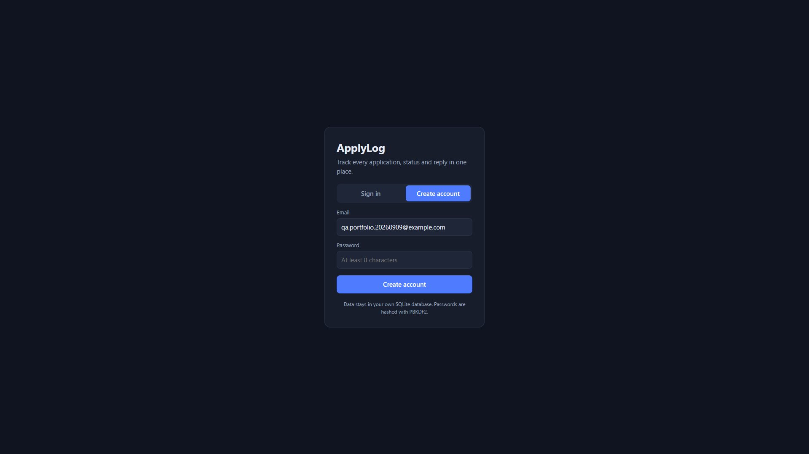

# BUG-001 — Auth hint says SQLite while the app uses Postgres

| | |
|--|--|
| Severity | Medium |
| Priority | Medium |
| Status | Open |
| Environment | Live demo https://applylog-or59.onrender.com/ + source on `main` |
| Area | Docs / Auth UI |
| Case | SEC-13 |
| Labels | `docs`, `ux` |

## Summary

The signed-out auth card tells users their data stays in “your own SQLite database,” but ApplyLog’s README, Compose setup, and backend use **Postgres**.

## Steps

1. Open the app signed out (or Sign out).
2. Read the small hint under the Sign in / Create account form.

## Expected

Hint matches the real stack (Postgres), or is generic (“your account database”).

## Actual

Text reads: “Data stays in your own SQLite database. Passwords are hashed with PBKDF2.”

Confirmed in `app/static/index.html` on `main`.

## Screenshot

## Notes

I read this while also reading the README and got confused — the app is Postgres, not SQLite. Anyone landing on the login page could get the wrong idea. Not a security hole, just wrong copy.
