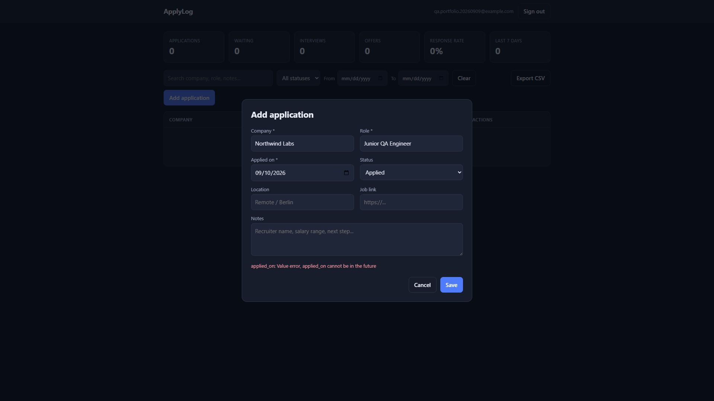

# BUG-003 — Validation errors shown as raw Pydantic messages

| | |
|--|--|
| Severity | Low |
| Priority | Medium |
| Status | Open |
| Environment | Live demo https://applylog-or59.onrender.com/ |
| Area | Applications / UX |
| Case | APP-07 |
| Labels | `ux` |

## Summary

When the API returns a 422 validation error, the dialog shows a developer-facing string instead of a short user message.

## Steps

1. Add application with **Applied on** = tomorrow (see BUG-002).
2. Save.
3. Read `#form-error`.

## Expected

Something like: “Applied date cannot be in the future.”

## Actual

`applied_on: Value error, applied_on cannot be in the future`

## Screenshot

## Notes

Looks like something from the API docs, not something I’d want a normal user to read. I’d map this to a plain sentence in the UI.
